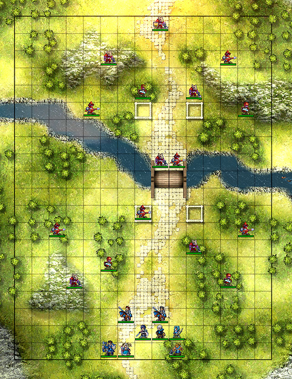

## Table of Contents

- [Introduction](#Introduction)
- [Requirements](#Requirements)
- [Installation](#Installation)
- [How to play](#How-to-play)
- [FAQ](#FAQ)
- [Support](#Support)
- [Contribution](#Contribution)
- [Licensing](#Licensing)

# FireEmblemAwakening
## What is Fire Emblem Awakening? 
Fire Emblem Awakening is a tactical role-playing game for the Nintendo 3DS developed by Intelligent Systems and published by Nintendo. The game revolves around controlling characters on a chess-like grid and having them battle enemy characters in turn-based combat in a story-driven singleplayer campaign.

## Requirements 
Fire Emblem Awakening requires:
* A Nintendo 3DS, 3DS XL, 2DS, New 3DS, New 3DS XL, or New 2DS XL console. 
* A Fire Emblem Awakening gamecart or digital purchase of the game on the Nintendo eShop. 

## Installation 
If using a gamecart, skip to Step 2.
### Step 1:
Download the game off of the Nintendo eShop on the 3DS console. Once the game is installed or inserted via gamecart it will appear on the home screen as an icon.
### Step 2:
Press the 'A' button on the icon with the Fire Emblem Awakening icon.
### Step 3:
If this is the first time you've played the game on the console, then it will prompt you to download and install an update; select yes.
### Step  4
The game prompt will prompt you to initalize data if its the first time you have played, allow it do so. Afterwards you will be put into the main menu and from there you can start playing.
## How to Play? 
### Controls
* Left Control Stick/Directional Pad | Navigating the UI
* 'A' button | Confirm
* 'B' button | Cancel
* 'X' button | Preperations Menu / Switch Weapon
* 'Y' button | Switch Weapon
* 'R' button | Zoom in/out
* 'L' button | Scroll through units
* Start/Select buttons | Skip event or dialogue

### Overworld

Most of your time when not in combat will be spent in the overworld. Here you can navigate between chapters, paralogues, shops,and random encounters. By pressing 'X' you can also manage your inventory of items, your units, and support conversations.

### Character Units
When in combat, you will be controlling many different character units, simply referred to as units, that you will acquire throughout the course of the game.

The above picture is an example of what a typical unit would look like in-game, here's a breakdown of everything shown:
* In the top left corner is the character portrait.
* To the right is the name of the unit, their class, experience level (LV), the amount of experience they have in that level (EXP, it's a value between 0 and 100), and their Health Point stats (HP), which represents how much damage the unit can take before it falls in battle.
* To the right of that is the Attack stat (Atk), which is a represenation of the unit's strength plus the might of the weapon they currently have equipped. The Hit stat, which is the accuracy of the unit. The crit stat, which is the chance that a unit will get a Critical Attack on a foe, which triples damage. Lastly, is Avoid (Avo) which is the chance of dogding any given attack by a foe.
* In the top right corner is the weaknesses of the unit (in this case, flying-effective and dragon-effective weapons) and below that is the Movement stat (mov) which is how many spaces a unit can move in any given action.
* The two columns on the left side are the unit's key stats, which are as follows:
  * Strength (Str) is the physical strength a given unit possesess, this affects how much damage a unit deals with physical weapons.
  * Magic (Mag) is the magical strength a given unit possesses, this affects how much damage a unit deals with magical weapons.
  * Skill (Skl) is the stat that determines how accurate a unit is as well as their chances of landing a Critical Attack.
  * Speed (Spd) is how fast a unit is, this determines the chances of a unit dodging a given attack as well as possibly giving the unit the opportunity to attack twice!
  * Luck (Lck) is how lucky a unit is, this affects their chances of *not* getting hit by a Critical Attack.
  * Defense (Def) is the unit's protection against physical damage, this determines how much damage they take from physical attacks.
  * Resistance (Res) is the unit's protection against magical damage, this determines how much damage they take from magical attacks.
* The 5 rows in the middle are the unit's inventory.
* In the bottom left corner is the unit's weapon experience which determines which weapons the unit can use.
* In the bottom right corner is the unit's skills (max of 5), which are abilities that have a chance of activiating during combat to benefit the unit.
### Combat
Combat consists of controlling your units on a chess-like grid with the objective being to defeat the enemy units.

You and the enemy take turns, being able to move and complete an action with each unit each turn. The battle ends when either all of the enemies units are defeated or your leader falls in battle. To initate combat between units, your unit must be in range of an enemy unit. From there you select a weapon and then the game will play an animation with your attack, showing the damage dealt alongside the animation. An enemy is defeated when their HP stat drops to 0. 

## FAQ 
### Can you recover your fallen units?
There are two different gameplay settings: casual and classic. In casual, fallen units are recovered at the end of the battle. In classic, there is permadeath, so fallen units do not return.
### How many chapters are in the game?
The game consists of 25 chapters.
### Is the game playable on any other platform?
While not officially supported, the game can be emulated on Windows computers using Citra, a 3DS emulation program. A guide for that can be found [here.](https://citra-emu.org/wiki/faq/)
### How long does the game take to complete?
On average, completing the 25 main chapters of the game takes around 12 hours.
## Where to Get Support 
If you have questions about the game you can consult the three main Fire Emblem Wikis, [Fire Emblem Fandom](https://fireemblem.fandom.com/wiki/Fire_Emblem_Wiki), [Fire Emblem Wiki](https://fireemblemwiki.org/wiki/Main_Page), and [Serenes Forest](https://serenesforest.net/). If you have problems with the game or 3DS, you can consult [Nintendo Support](https://en-americas-support.nintendo.com/).
## How to Contribute 
You can contribute by adding to any of the three 3 wikis.
## Licensing 
All Fire Emblem content is licensed by Nintendo and Intelligent Systems.
